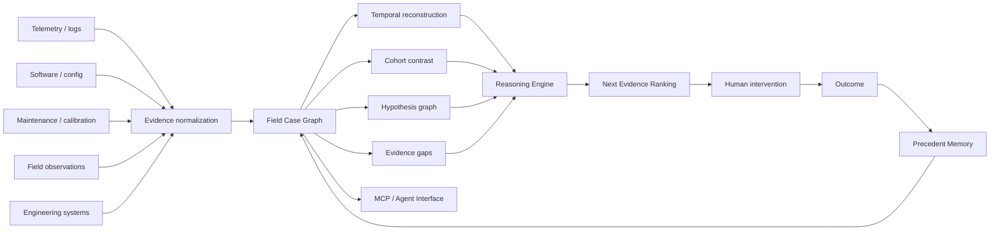
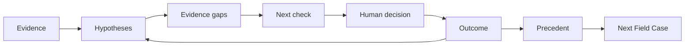

# Veyra

**Veyra is Field Case Intelligence for deployed Physical AI.**

Veyra turns fragmented machine, software, environmental and human evidence into a structured **Field Case** that can be queried, compared, challenged and reused.

The core technical problem is not generating another AI answer.

It is maintaining the evolving evidence state around a real-world incident:

**what happened → what changed → what differs → what could explain it → what is still unknown → what evidence would reduce uncertainty → what humans did → what happened next**

---

## Core architecture



**Models reason over the case. Veyra owns the case.**

---

## Technical primitives

### 1. Field Case Graph

A Field Case is not a text summary.

It is a typed graph of:

`Machine · Change · Evidence · Hypothesis · EvidenceGap · Check · Decision · Intervention · Outcome · Precedent`

with relationships such as:

`supports · contradicts · shared_by · tested_by · resulted_in · strengthens · weakens · similar_to`

---

### 2. Temporal evidence

Physical-world investigations have multiple clocks:

`event_time` — when something happened  
`known_at` — when the team could have known it  
`ingested_at` — when Veyra received it

This lets Veyra distinguish hindsight from what was actually knowable when a decision was made.

---

### 3. Cohort contrast

Veyra compares affected systems against valid healthy comparators.

It looks for conditions that discriminate:

`affected cohort ↔ healthy cohort`

rather than analysing failed machines in isolation.

---

### 4. Competing hypotheses

Veyra does not collapse uncertainty into a single generated root cause.

Each hypothesis keeps:

`supporting evidence · contradicting evidence · missing evidence · what would change our mind`

---

### 5. Next Evidence Engine

Veyra asks:

> **Which observation would best separate the remaining hypotheses at acceptable cost and risk?**

The system optimizes for the **next useful piece of evidence**, not the most confident-sounding answer.

---

### 6. Intervention–Outcome Memory

Veyra preserves:

`evidence → belief state → recommendation → human decision → intervention → physical outcome → belief update`

So the next field case can inherit prior hypotheses, actions, outcomes and unresolved questions.

---

## Agent-native, model-agnostic

Veyra exposes structured Field Case operations through an MCP-compatible tool surface:

```text
case.get
timeline.query
assets.compare
hypotheses.list
hypotheses.evidence
evidence.gaps
checks.rank
interventions.record
outcomes.record
precedents.search
```

Frontier models can improve over time without changing the core product.

**The agent is replaceable. The structured field history is cumulative.**

---

## What varies vs what compounds

| Customer-specific | Veyra core |
|---|---|
| Connectors | Field Case schema |
| Source naming | Temporal reconstruction |
| Schema mapping | Cohort contrast |
| Machine terminology | Hypothesis graph |
| Data location | Evidence-gap reasoning |
| Authentication | Intervention-outcome memory |
|  | Precedent retrieval |

**We configure the evidence sources. We do not redesign the investigation.**

---

## System loops



One loop reduces uncertainty inside the case.

The second prevents the organization from relearning the same lesson.
```
